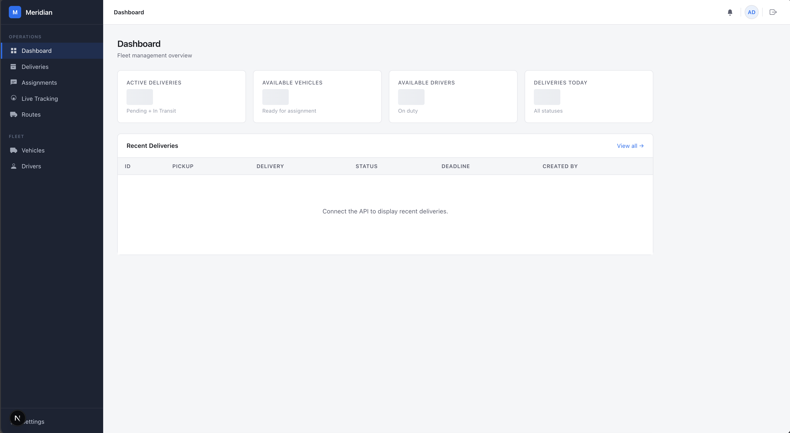
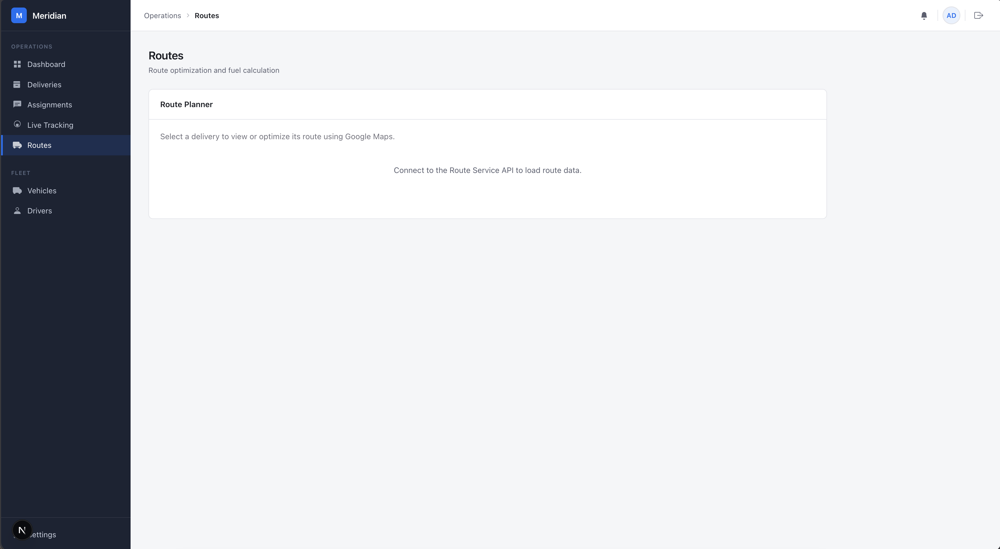
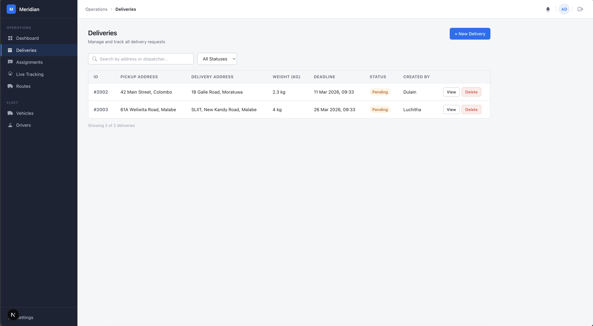

# Meridian Frontend

Meridian is a comprehensive logistics and delivery management platform. The `meridian-frontend` application serves as the primary user interface to interact with the Meridian microservices ecosystem, allowing administrators and operators to monitor deliveries, manage vehicles and drivers, track routes, and handle assignments in real-time.

This project is built with [Next.js](https://nextjs.org/) and interacts with the various backend microservices through the API Gateway.

## Features

- **Dashboard**: High-level overview of system metrics and active operations.
- **Delivery Management**: View, create, and manage deliveries.
- **Driver Management**: Manage driver profiles, availability, and assignments.
- **Vehicle Management**: Track vehicle status, maintenance, and allocation.
- **Route Tracking**: Real-time tracking of active routes and deliveries.
- **Assignment Service**: Efficiently assign drivers and vehicles to deliveries.

## Screenshots

### Dashboard Overview

*A high-level view of active deliveries, available drivers, and vehicle statuses.*

### Real-Time Route Tracking

*Live tracking interface showing active delivery routes on the map.*

### Delivery Management

*Interface for creating and managing delivery details and statuses.*

## Getting Started

### Prerequisites

- Node.js (v18 or newer recommended)
- npm, yarn, pnpm, or bun

Ensure the Meridian Backend microservices and the API Gateway are running locally or accessible via your environment configuration.

### Installation

Clone the repository and install the dependencies:

```bash
cd meridian-frontend
npm install
# or
yarn install
```

### Development Server

Run the development server:

```bash
npm run dev
# or
yarn dev
# or
pnpm dev
# or
bun dev
```

Open [http://localhost:3000](http://localhost:3000) with your browser to see the application.

## Playwright Tests

This project includes Playwright end-to-end tests for auth, dispatcher workflows, driver dashboards, and visual regression coverage.

### Run the tests

```bash
npm run test:e2e
```

### Useful test commands

```bash
npm run test:e2e:headed
npm run test:e2e:report
npm run test:e2e:visual
```

### Test screenshots

Some Playwright tests save screenshots to:

```bash
tests/e2e/screenshots/
```

These include dispatcher workflow screenshots and driver dashboard screenshots that can be used for visual review.

## Project Structure

- `app/`: Next.js App Router containing pages and layouts.
- `components/`: Reusable UI components.
- `lib/` or `utils/`: Utility functions and API client configurations.
- `types/`: TypeScript definitions for the domain models (e.g., Deliveries, Drivers, Vehicles).

## Backend Integration

This frontend communicates directly with the Meridian backend through the **API Gateway**. Set `NEXT_PUBLIC_API_BASE_URL` in `.env.local` for local development and in the Azure Static Web Apps environment configuration for production deployments. For the current Azure deployment, this should point to `https://ca-api-gateway.purplehill-a8c48699.eastasia.azurecontainerapps.io`.
